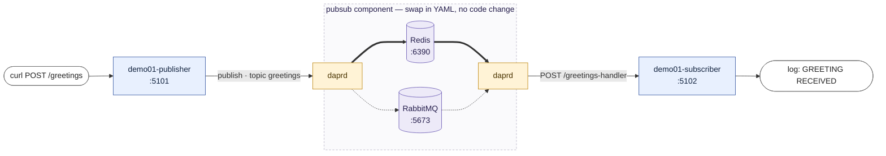
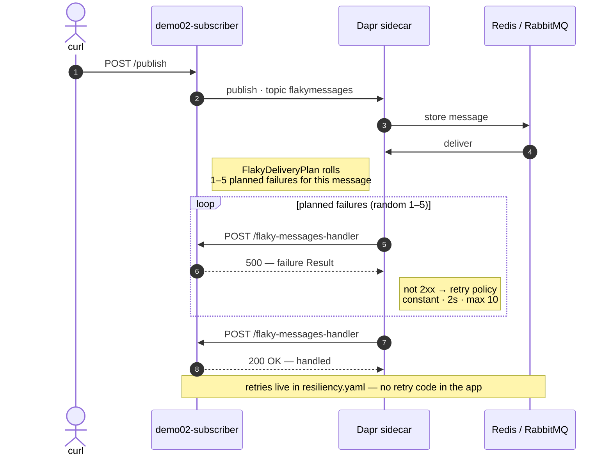
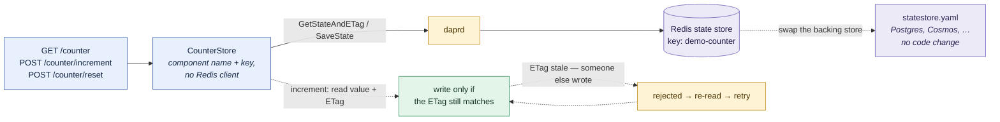
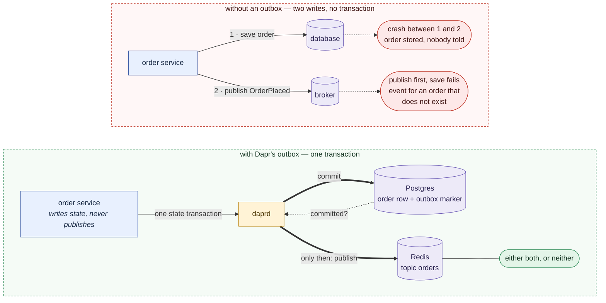
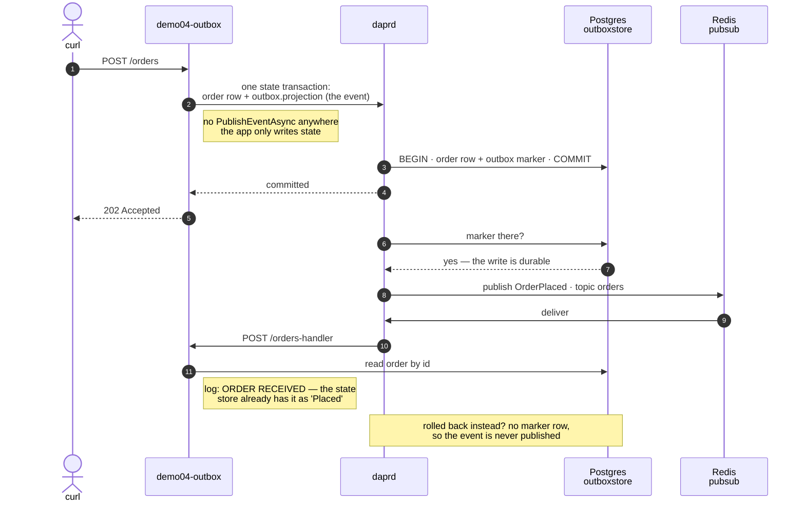

# Demo diagrams

One Mermaid diagram per demo — two for demo 04, the problem then the mechanism — sized for a
slide. Ready-made PNG exports (2× scale, white background) are in `docs/images/` — drag them
straight onto a slide. To restyle or
re-export, paste a block below into <https://mermaid.live> (SVG stays crisp when scaled),
or re-render everything with:

```bash
# from the repo root — mermaid-cli names the exports after the -o file, in document order
npx -y @mermaid-js/mermaid-cli -i docs/diagrams.md -o docs/images/out.md -e png -b white -s 2
cd docs/images
mv out-1.png demo01-pubsub.png
mv out-2.png demo02-retries.png
mv out-3.png demo03-statestore.png
mv out-4.png demo04-outbox-problem.png
mv out-5.png demo04-outbox.png
rm out.md
```

Legend used throughout: **blue** = our code, **amber** = the Dapr sidecar,
**purple** = external system, **white** = the presenter's `curl` / the log line,
**red** = the failure path.

## Demo 01 — Pub/sub through the sidecar



## Demo 02 — Retries: a non-2xx is the retry mechanism



## Demo 03 — State store through the sidecar



## Demo 04a — The dual-write problem the outbox solves



## Demo 04b — Transactional outbox: the flow



