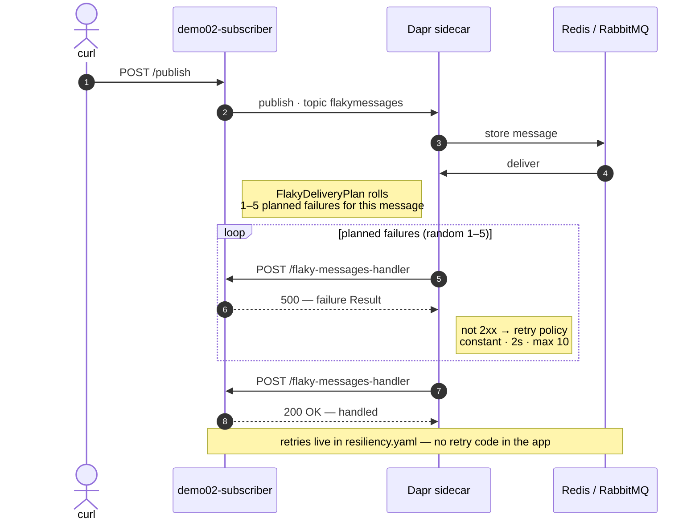
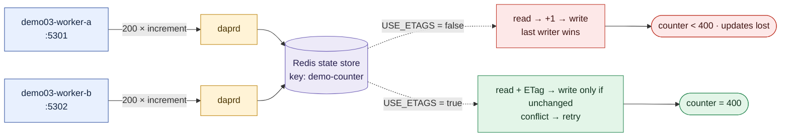
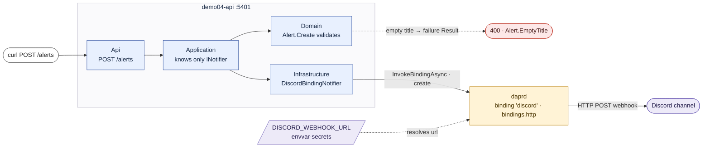

# Demo diagrams

One Mermaid diagram per demo, sized for a slide. Ready-made PNG exports (2× scale,
white background) are in `docs/images/` — drag them straight onto a slide. To restyle or
re-export, paste a block below into <https://mermaid.live> (SVG stays crisp when scaled),
or re-render everything with:

```bash
npx @mermaid-js/mermaid-cli -i docs/diagrams.md -o /tmp/out.md -e png -b white -s 2
```

Legend used in all four: **blue** = our code, **amber** = the Dapr sidecar,
**purple** = external system, **white** = the presenter's `curl` / the log line.

## Demo 01 — Pub/sub through the sidecar


## Demo 02 — Retries: a non-2xx is the retry mechanism



## Demo 03 — State store: ETags vs. lost updates



## Demo 04 — Output binding to Discord


